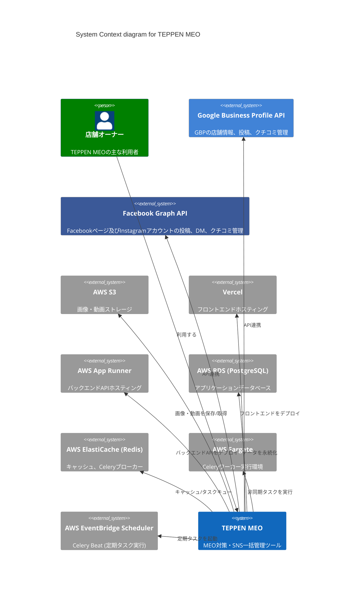
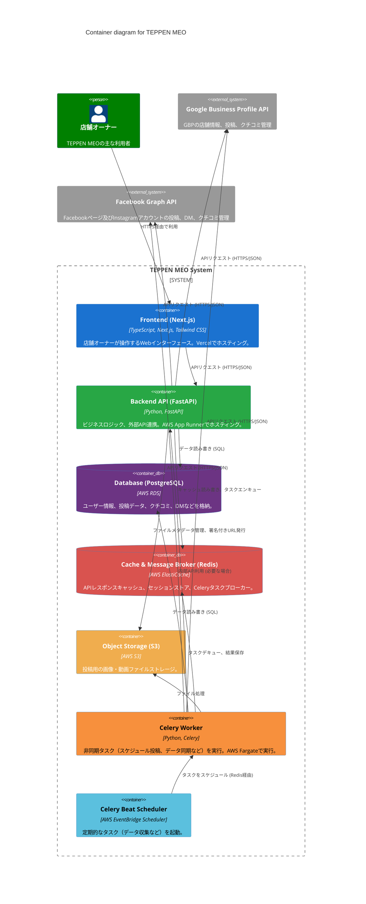

# TEPPEN MEO システムアーキテクチャ

## 概要

このドキュメントは、TEPPEN MEOアプリケーションのアーキテクチャをC4モデルに基づいて記述したものです。

## 1. System Context Diagram (システムコンテキスト図)

TEPPEN MEO システムと外部システムとの関連を示します。



### データフロー

*   店舗オーナーはTEPPEN MEOのフロントエンド（Vercel上でホスト）を通じてシステムを利用します。
*   TEPPEN MEOバックエンド（AWS App Runner上でホスト）は、Google Business Profile API、Facebook Graph APIと連携し、投稿、クチコミ、DMなどの情報を送受信します。
*   画像や動画はAWS S3に保存されます。
*   アプリケーションデータはAWS RDS (PostgreSQL) に永続化され、キャッシュやセッション情報はAWS ElastiCache (Redis) に保存されます。
*   非同期処理（スケジュール投稿、データ同期など）はCeleryワーカー (AWS Fargate) によって実行され、AWS EventBridge Schedulerが定期タスクをトリガーします。

## 2. Container Diagram (コンテナ図)

TEPPEN MEO システムを構成する主要なコンテナ（アプリケーション、データストアなど）を示します。



### データフロー詳細 (例)

*   **投稿機能**:
    1.  店舗オーナーがフロントエンドで投稿内容を作成・スケジュール設定。
    2.  フロントエンドはバックエンドAPIに投稿データ（テキスト、S3上の画像/動画URL、スケジュール日時）を送信。
    3.  バックエンドAPIは投稿データをDBに保存し、スケジュール日時が未来であればCeleryタスクをRedisにエンキュー。
    4.  指定時刻になるとCelery BeatがCeleryワーカーを起動（またはFargate上のワーカーがRedisからタスクをデキュー）。
    5.  Celeryワーカーが各プラットフォームAPI（Google, Facebook/Instagram）に投稿を実行。
    6.  結果をDBに保存し、必要であればユーザーに通知。

*   **DM同期機能**:
    1.  (初回または定期) Celery BeatがDM同期タスクを起動。
    2.  CeleryワーカーがFacebook/Instagram APIにアクセスし、新しいメッセージを取得。
    3.  取得したメッセージをDBに保存。
    4.  店舗オーナーがフロントエンドでDM画面を開くと、バックエンドAPI経由でDBから最新DMを取得表示。
    5.  店舗オーナーが返信すると、バックエンドAPI経由で該当プラットフォームAPIに送信、DBも更新。


## 3. Component Diagram (コンポーネント図) - (オプション)

特定のコンテナ内の主要なコンポーネントとそのインタラクションを示します。 (必要に応じて作成)

例: Backend API のコンポーネント図

```mermaid
C4Component
  title Component diagram for Backend API

  Container(backend_api, "Backend API (FastAPI)") {
    Component(auth_module, "認証モジュール", "FastAPI Router", "ユーザー認証、トークン管理")
    Component(post_module, "投稿管理モジュール", "FastAPI Router", "投稿作成・編集・取得API")
    Component(dm_module, "DM管理モジュール", "FastAPI Router", "DM取得・送信API")
    Component(review_module, "クチコミ管理モジュール", "FastAPI Router", "クチコミ取得・返信API")
    Component(platform_service, "プラットフォーム連携サービス", "Python Module", "Google/Facebook APIラッパー")
    Component(db_service, "データベースサービス", "SQLAlchemy", "DBアクセス、ORM")
  }
  System_Ext(database, "Database (PostgreSQL)")
  System_Ext(google_b_api, "Google Business Profile API")
  System_Ext(facebook_api, "Facebook Graph API")

  Rel(auth_module, db_service, "ユーザー情報検証")
  Rel(post_module, db_service, "投稿データCRUD")
  Rel(post_module, platform_service, "外部プラットフォームへ投稿")
  Rel(dm_module, db_service, "DMデータCRUD")
  Rel(dm_module, platform_service, "外部プラットフォームとDM送受信")
  Rel(review_module, db_service, "クチコミデータCRUD")
  Rel(review_module, platform_service, "外部プラットフォームのクチコミ操作")

  Rel(platform_service, google_b_api, "APIコール")
  Rel(platform_service, facebook_api, "APIコール")
  Rel(db_service, database, "SQL実行")

```

## 4. Code Diagram (コード図) - (オプション)

特定のコンポーネントのクラス構造など、より詳細な実装レベルを示します。 (通常はアーキテクチャドキュメントでは省略)


## 更新履歴

*   YYYY-MM-DD: 初版作成 